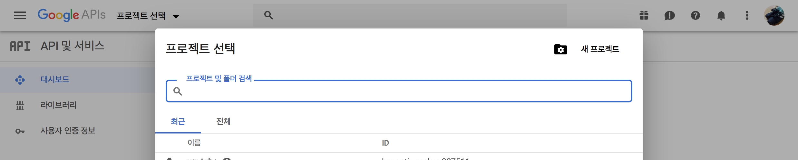
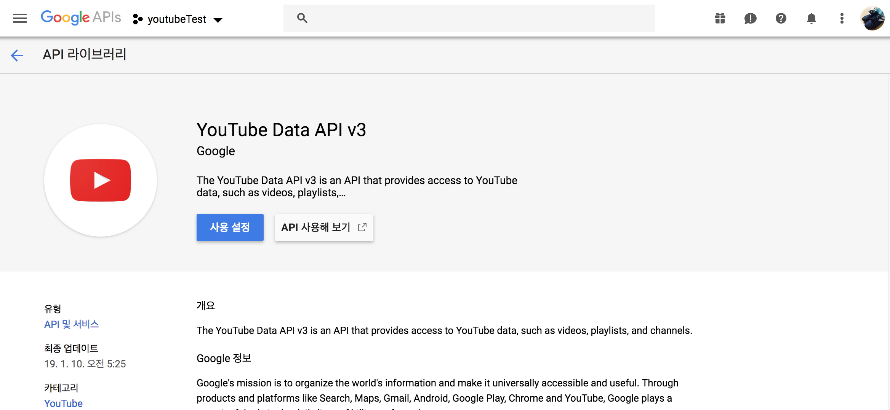
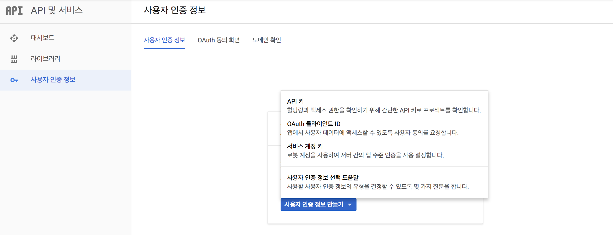
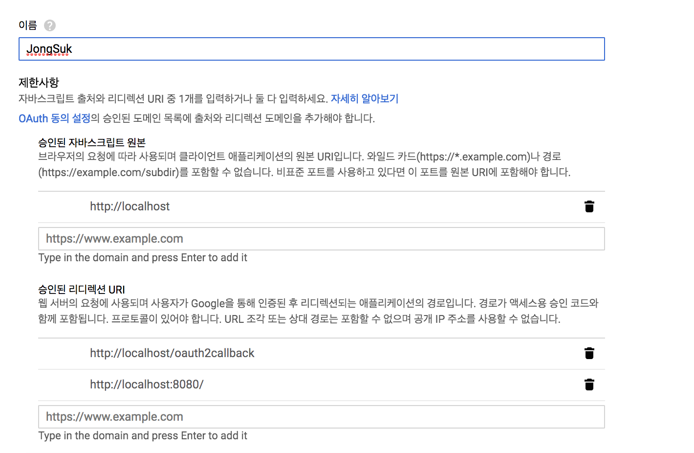
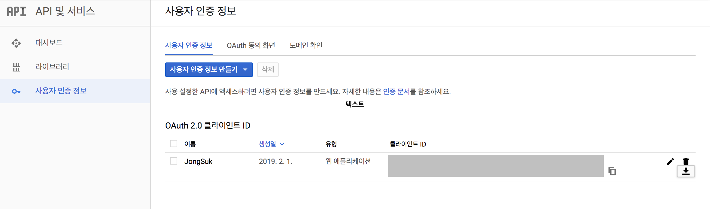

# Youtube API (comments extract)

## Google Development API

Google API를 사용하기 위해서 사용자인증과 토큰 발급이 필요합니다. 사용자 인증은  https://console.developers.google.com/apis에서 진행합니다.

1. 사이트에 접속 후 새로운 프로젝트를 생성합니다. 원하는 이름으로 프로젝트를 생성하세요.
2. 프로젝트가 생성되면 왼쪽 메뉴, `API 및 서비스`에서 `라이브러리`를 누르고 검색창에 "Youtube"라고 칩니다. 우리는 Youtube Data API v3를 사용할 것입니다. Youtube Data API v3를 눌러 `사용설정`을 누릅니다. 
3. API를 사용할 때, 사용자의 동의를 받는 내용을 설정합니다. 특별히 **개인 서버에서 다른 사용자에게 배포할 용도가 아니므로 사용자 인증정보 - 상단메뉴, `OAuth 동의화면`에서 어플리케이션 이름만 넣고 저장합니다.**
4. 이제 youtubeAPI를 사용할 사용자를 인증하는 절차를 밟겠습니다. 사용자 인증은 두갈레로 나뉩니다. 
   * `commentAPI`를 사용하기 위해서는 사용자가 누구인지(로그인 정보), 어디서 사용할 건지(서버, 클라이언트…) 등의 내용이 필요하기 때문에 이러한 내용을 포함한 토큰을 발급받는 `OAuth 2.0`으로 사용자를 인증합니다. (이는 댓글을 달거나 비디오를 올리는 자동화 된 API를 포함하고 있으므로 로그인 정보가 필요하기 때문입니다.)
   * `searchAPI`는 사용자 정보는 필요하지 않기 때문에 간단하게 `API Key`만 발급받으면 됩니다.

### OAuth 2.0

1. 다시 홈으로 돌아가, 왼쪽 메뉴에서 `사용자 인증 정보`를 클릭합니다. 사용자 인증 정보를 아직 만들지 않았으므로 `사용자 인증 정보 만들기` 버튼이 활성화 되어있습니다. 버튼을 누른 뒤 `OAuth 클라이언트 ID`를 누릅니다. 
2. **어플리케이션 유형**은 `웹 어플리케이션`을 선택하고 이름을 입력합니다.
3. 로컬에서만 사용하므로 **승인된 자바스크립트 원본**은 `http://localhost`를 입력합니다.
4. `리디렉션 URI`는 사용자가 동의버튼을 누르면 이동하는 경로입니다. `http://localhost/oauth2callback`과 `http://localhost:8080/`을 추가합니다. 
5. 생성을 누릅니다.

이제 내 정보를 포함한 `client_secrets`이 생겼습니다. 생성된 사용자 인증의 오른쪽에 `다운로드 버튼`을 클릭해서 JSON파일을 다운로드 받을 수 있습니다. `client_secrets`으로 이름을 변경한 뒤, 이 프로젝트 폴더에 넣습니다. 

### API Key

1. 이번에는 API Key를 만들겠습니다. `사용자 인증 정보 만들기`를 클릭한 뒤, `API 키`를 누릅니다.
2. 끝입니다. API Key가 생성됐습니다. 이 값은 나중에 `searchAPI.py` 파일 안에서 사용됩니다.


## AWS DB 설정

*https://github.com/pseudotop/crawler-news 을 참고하고 AWS db에 관련된 모듈은 모두 여기에 있는 내용을 약간만 바꿨습니다.*


## 필요한 라이브러리

python3를 사용하기 때문에 pip3로 설치합니다. pip 버전이 python3에 적용되어 있다면 pip install로 설치하시기 바랍니다.


* httplib2

* ```bash
  $ sudo pip3 install --upgrade google-api-python-client
  ```

* apiclient

* ```bash
  $ sudo pip3 install --upgrade google-api-python-client
  ```

  *(아마존 서버에서 설치시 Error가 발생하면 맨 뒤에 `--user`를 붙일 것.)*

* oauth2client

* ```bash
  $ sudo pip3 install oauth2client
  ```

* googleapiclient

* ```bash
  $ sudo pip3 install --upgrade google-api-python-client
  ```

  *(아마존 서버에서 설치시 Error가 발생하면 맨 뒤에 `--user`를 붙일 것.)*


## 사용법

secret json 파일

develop key 넣기

oauth 파일 옮겨오는법

커멘드 사용법


## (자세히) Youtube API

총 4가지의 youtube API를 사용합니다.

- **`search`** : **search term(검색어)와 옵션을 인자로 받아와서 videoID를 추출합니다.** order에 따라서 리스트업되는 동영상의 성격을 바꿀 수 있습니다. `최근 날짜`, `높은 관련도`, `제목순서`, `높은 조회수`로 동영상을 정렬합니다. 
- **`videos` : 비디오의 정보를 가져오는 메서드로 조회수, 좋아요, 싫어요 등의 통계수치를 가져올 수 있습니다.**
- **`commentThreads`** : **하나의 videoID를 인자로 받아와서 댓글을 추출합니다.** (*Error : 최상위 댓글은 추출되나, 대댓글은 최대 5개만 추출되는 버그가 있음*)
- **`comment`** : **하나의 commentID를 인자로 받아와서 댓글의 정보와 댓글에 달린 대댓글(replies)을 추출합니다.** commentThreads API의 버그(대댓글이 최대 5개까지 밖에 추출되지 않음)를 보완합니다. 

`commentThreads`와 `comment`, `videos` API는 작동방식이 같으므로 `commentAPI.py` 파일에 통합시켰습니다.

`search` API는 `searchAPI.py`에서 사용하고 `commentAPI.py`에서 모듈로 사용됩니다.


### 동작흐름

1. `searchAPI.py 파일 - youtube_search 함수` : 원하는 조건에 맞는 비디오를 검색해서 video_id를 배열에 저장. 배열에 있는 video_id를 돌아가면서 밑의 작업을 반복.
2. `commentAPI.py 파일 - get_videoStatistics 함수` : video 통계치 추출 및 변수에 저장.
3. `commentAPI.py 파일 - get_allComments 함수` : video 통계치와 video_id를 가지고 db 테이블의 한개의 row 생성.
4. `commentAPI.py 파일 - get_comments 함수` : video_id를 가지고 최상위 댓글 추출 (snippet 형태).
5. `commentAPI.py 파일 - load_comments 함수` : get_comments에서 추출한 snippet에서 댓글 정보, 댓글 내용 등을 분류하고 db에 작성. 여기서 추출된 댓글 id를 가지고 get_replies에 전달.
6. `commentAPI.py 파일 - get_replies 함수` : get_comments 함수에서 뽑아내지 못한 대댓글 추출 (snippet 형태).
7. `commentAPI.py 파일 - load_replies 함수` : 대댓글 정보, 대댓글 내용 등을 분류하고 db에 작성.
8. **1번에서 뽑아낸 배열의 video_id를 모두 훑을 때까지 2번부터의 과정을 반복**


### search

원하는 비디오의 list를 뽑아내기 위해서 `search` 메서드를 사용합니다. `search`메서드는 검색어(`q`)와 결과최대추출량(`maxResult`), 다음페이지토큰(`pageToken`)등을 인자로 받습니다.

```python
## searchAPI.py

def youtube_search(page_token, resultSize, keyword):

  youtube = build(YOUTUBE_API_SERVICE_NAME, YOUTUBE_API_VERSION,
    developerKey=DEVELOPER_KEY)

  ## search 메서드 사용															---(1)
  search_response = youtube.search().list(
    part='snippet',
    q=keyword,
    maxResults=50,
    pageToken=page_token,
    # order=options.order,
  ).execute()

  ## snippet 형태에서 video 검색결과만 videos 배열에 추가								---(2)
  for search_result in search_response.get('items', []):
    if search_result['id']['kind'] == 'youtube#video':
      videos.append(search_result)
    ## 원하는 비디오 리스트 개수만큼 나오면 중지
    if len(videos) == resultSize:
      return videos

  ## 비디오 리스트 다음페이지가 없을 때까지 재귀호출
  if "nextPageToken" in search_response:
    print(search_response["nextPageToken"])
    youtube_search(search_response["nextPageToken"], resultSize)

  return videos
```

* `주석 (1)` : `youtube.search` 메서드를 이용해 검색어를 인자로 받아 snippet 형태로 반환합니다.
* `주석 (2)` : snippet 형태의 결과에서 비디오 형태일 때만 item(video)들을 videos 배열에 추가합니다.

**`youtube.search`가 받는 인자는 `commentAPI.py`파일의 main 함수에서 `argparser`로 받아옵니다.**


### videos

`videos`는 `video id`를 인자로 받아서 비디오 정보에 접근할 수 있는 메서드입니다. 그 중에 **part 옵션을 `statistics`로 주면 조회수, 좋아요, 싫어요와 같은 통계치를 가져올 수 있습니다.**

```python
## commentAPI.py

def get_videoStatistics(youtube, video_id):
  results = youtube.videos().list(
    part='statistics',
    id=video_id
  ).execute()
  return results
```

댓글을 본격적으로 추출하기 전에 `video_id`를 비롯한 많은 통계치를 가지고 로우(row)를 작성한 다음 댓글을 뽑아서 db에 쓰기 시작합니다.

```python
## commentAPI.py

def get_allComments(videoid):
  ## video ID
  args.videoid = videoid

  global youtube
  youtube = get_authenticated_service(args)
  
  ## infromation of video
  title = video["snippet"]["title"]
  print('<<', title, '>>')
  author = video["snippet"]["channelTitle"]
  createAt = video["snippet"]["publishedAt"]
  #discription = video["snippet"]["discription"]
  channelId = video["snippet"]["channelId"]
  ## 비디오 통계치
  ## 좋아요, 싫어요를 표시하지 않는 경우도 있다.											  ---(1)
  statistics = get_videoStatistics(youtube, args.videoid)
  viewCount = statistics["items"][0]["statistics"]["viewCount"]
  if "likeCount" in statistics["items"][0]["statistics"]:
    likeCount = statistics["items"][0]["statistics"]["likeCount"]
    dislikeCount = statistics["items"][0]["statistics"]["dislikeCount"]
  else:
    likeCount = "Unknown"
    dislikeCount = "Unknown"

  ## db 테이블 생성																	---(2)
  comments.init()
  comments.set_info(dict(videoID=args.videoid, title=title, author=author, createdAt=createAt, channelId=channelId, viewCount=int(viewCount), likeCount=int(likeCount), dislikeCount=int(dislikeCount)))

  ## 본격적인 댓글 추출 시작															  ---(3)
  try:
    match = get_comments(youtube, args.videoid, None)
    load_comments(match)
    comments.set_contents()
    
  except HttpError as e:
    print ("An HTTP error %d occurred:\n%s" % (e.resp.status, e.content))
  else:
    print ("################### All Comments of One Video ###################")
```

* `주석 (1)` : `get_videoStatistics`메서드를 이용해 비디오 정보(통계치)를 가져온다
* `주석 (2)` : 비디오 정보와 함께 데이터 베이스 로우(row)를 생성한다.
* `주석 (3)` : 본격적으로 댓글을 추출하는 함수를 실행합니다. **`get_comments로 받아온 snippet`을 변수에 저장해서 `load_comments 함수`에 인자로 전달합니다.**


### commentThreads

Youtube API가 제공하는 수많은 메서드 중에서 댓글을 추출할 수 있는 `commentThreads.list`를 사용했습니다. **이 메서드는 `필수 인자(required)`, `필터링 인자(filters)`, `옵션 인자(option)`의 종류인 수많은 parameter를 받습니다.** 많은 parameter 중에서 다음과 같은 parameter만 사용했습니다.

* `part` : commentThreads.list 메서드는 `,`로 나뉘어진 배열의 결과를 반환합니다. 배열안에 있는 데이터는 key-value 형식으로 구성되는데,  `snippet(최상위 댓글)`의 key를 가진 value와 `replies(대댓글)`의 key를 가진 value를 각각 반환시킬 수 있습니다. 하나의 게시글에 달린 댓글은 다음과 같은 구조를 갖습니다.

  ```text
  item
  ├── snippet
  │   ├── textDisplay (최상위 댓글1)
  │   ├── replies
  │   |	├── snippet
  |	|	|	├── textDisplay (댓글1의 대댓글1)
  │   |	├── snippet
  |	|	|	├── textDisplay (댓글1의 대댓글2)
  ├── snippet
  │   ├── textDisplay (최상위 댓글2)
  .
  .
  .
  ```


메서드의 옵션은 다음과 같습니다.

* `videoId` : 해당 videoID를 가진 비디오의 댓글 item을 가져옵니다.
* `maxResults` : 한번에 가져오는 item 수 (댓글 snippets 수), 최대 100까지 사용 가능합니다.
* `pageToken` : maxResult만큼 댓글을 추출했으나 아직 item이 남아있는 경우 pageToken이 반환되고, 반환되는 pageToken을 옵션에 넣어주면 다음페이지의 item이 추출됩니다.
* `textFormat` : item을 어떤 형식으로 가져올지 결정합니다.

위의 설명을 기반으로 옵션과 함께 사용한 `commentThreads.list` 메서드를 함께 살펴보겠습니다.

```python
## commentAPI.py

def get_comments(youtube, video_id, page_token):
  results = youtube.commentThreads().list(
    part="snippet",
    maxResults=100,
    videoId=video_id,
    pageToken=page_token,
    textFormat="plainText"
  ).execute()
  return results
```

이 함수가 실행되면 해당 `video_id`를 가지고 최대 100개의 item(댓글)을 가지고 있는 거대한 snippet을 반환합니다. 그리고 **item(댓글)이 100개가 넘어갈 경우 pageToken이 반환되므로 이후 재귀를 통해 pageToken을 넣어 다시 함수를 실행**할 수 있도록 매개변수에 추가해두었습니다(`page_token`). 이 큰 덩어리의 snippet에서 댓글등록 날짜, 댓글내용 등을 가져오는 함수를 따로 작성했습니다.

```python
## commentAPI.py

def load_comments(match):

  global num
  for item in match["items"]:
    ## 유형
    type = "topLevelComment"
    ## 최상위 댓글
    commentDisplay = item["snippet"]["topLevelComment"]["snippet"]["textDisplay"]
    ## 부모댓글 = 없음
    parentId = None

    ## 최상위 댓글 id
    id = item["snippet"]["topLevelComment"]["id"]
    ## 최상위 댓글 작성자
    commentAuthor = item["snippet"]["topLevelComment"]["snippet"]["authorDisplayName"]
    commentAuthorId = item["snippet"]["topLevelComment"]["snippet"]["authorChannelId"]["value"]
    ## 작성날짜
    commentDate = item["snippet"]["topLevelComment"]["snippet"]["publishedAt"]
    ## 좋아요
    commentLikeCount = item["snippet"]["topLevelComment"]["snippet"]["likeCount"]

    ## db 추가
    comments.add_comments(type, id, parentId, commentDisplay, commentAuthor, commentAuthorId, commentDate, commentLikeCount)
    print(commentDisplay)

    ## 개수
    num += 1
    print (num)

    ## 현재 "최상위 댓글"의 id 전달, 대댓글 확인											---(1)
    load_replies(id)
    
  ## 다음페이지가 있을 경우	  														  ---(2)  
  if "nextPageToken" in match:						
    match = get_comments(youtube, args.videoid, match["nextPageToken"])
    load_comments(match)
```

위와 같이 payload의 key값으로 원하는 정보를 가져올 수 있습니다. **위의 `load_comments` 함수는 댓글을 추출해 db에 작성하는 함수입니다.** 

* `주석 (1)` : *다음 섹션 참조*
* `주석 (2)` : pageToken이 발급된 경우(댓글이 100개를 넘어가는 경우), `pageToken`을 인자로 전달해 `get_comments`를 실행한 뒤 `load_comments` 함수를 다시 호출한다(재귀). 


### comment

`commentThread`를 통해 추출되는 대댓글의 개수는 최대 5개까지 밖에 나오지 않습니다. 그래서 다른 API 메서드를 사용합니다. `comment` 메서드는 `commentThread`와 다르게 **댓글이 가지고 있는 고유의 id를 인자로 받아서 해당 댓글의 정보와 대댓글을 전부 반환합니다.** 반환 형식은 위의 `commentThread`와 거의 유사합니다.

```python
## commentAPI.py

def get_replies(youtube, parent_id):
  results = youtube.comments().list(
    part="snippet",
    maxResults=100,
    parentId=parent_id,
    textFormat="plainText"
  ).execute()
  return results
```

`youtube.comments` 메서드를 사용하고 `parentId(부모 댓글 Id)`를 인자로 받습니다. 대댓글도 최상위 댓글과 비슷하게 다음과 같이 정보를 쪼개서 저장합니다.

```python
## commentAPI.py

def load_replies(id):
  global num
  match = get_replies(youtube, id)
  for item in match["items"]:
    ## 유형
    type = "reply"
    ## 대댓글
    commentDisplay = item["snippet"]["textDisplay"]
    ## 부모댓글 id
    parentId = item["snippet"]["parentId"]
    ## 대댓글 id
    id = item["id"]
    ## 대댓글 작성자
    commentAuthor = item["snippet"]["authorDisplayName"]
    commentAuthorId = item["snippet"]["authorChannelId"]["value"]
    ## 작성날짜
    commentDate = item["snippet"]["publishedAt"]
    ## 좋아요
    commentLikeCount = item["snippet"]["likeCount"]

    ## db 추가 
    comments.add_comments(type, id, parentId, commentDisplay, commentAuthor, commentAuthorId, commentDate, commentLikeCount)
    print(commentDisplay)

    ## 개수
    num += 1
    print (num)
```