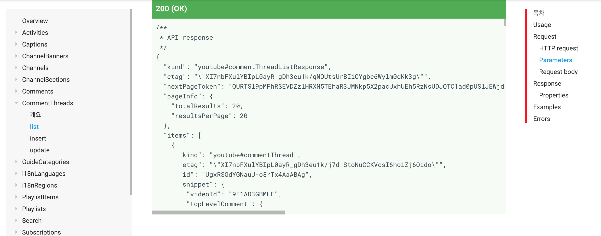
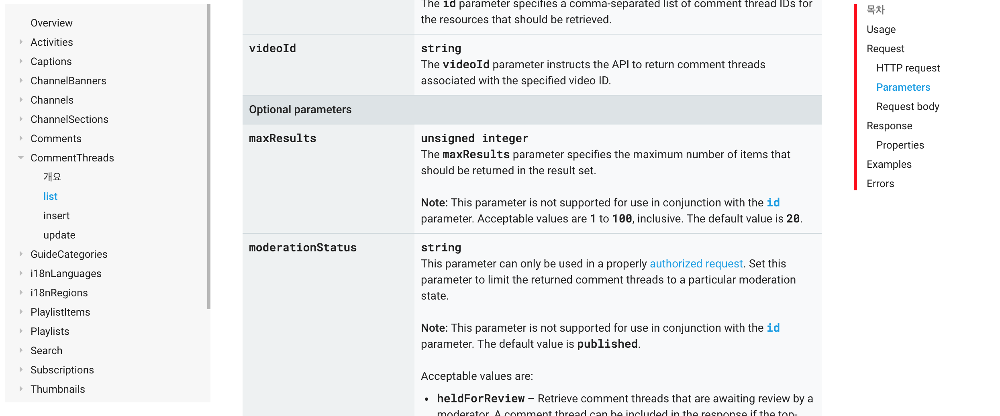

# Youtube API, comment_threads 기능 중 get_comments만 사용하기

코드는 Youtube API github(https://github.com/youtube/api-samples)에서 받을 수 있다.

Python만 사용.

## 1. API Key 발급받기

### Trial and Error

처음에는 https://help.aolonnetwork.com/hc/en-us/articles/218079623-How-to-Create-Your-YouTube-API-Credentials 보고 따라함. `client_screts.json` 받아서 같은 폴더에 저장. 실행시키면 브라우저가 열리더니 `redirect URI`가 맞지 않다고 나옴. 

맞춰야 하는 `redirect URI`를 제시해주길래 다시 https://console.developers.google.com/apis로 가서 사용자인증정보(credentials)의 `redirect URI`를 제시한 URI를 추가해서 `client_screts.json` 다시 다운로드. 

실행되는 브라우저에서 알 수 없는 에러가 계속 발생.

### Trial and Half Seccess

API key에 담긴 내용이 잘못되었나 싶어 공식 API 홈페이지에서 API key를 발급받는 과정을 동영상을 찾아냄. https://developers.google.com/youtube/v3/getting-started?hl=ko 보고 그대로 따라함. 첫번째 사이트에서 가이드하는 과정 중 Creat Refresh Token 부분은 뭘하는 작업인지 모르겠음. 이곳 공식 API 홈페이지 발급과정에는 나오지 않는 부분임. 

위 첫번째 사이트의 가이드와 다른 점은 승인된 자바스크립트 원본 경로(http://localhost)를 추가해주고 `redirect URI`를 http://localhost/autho2callback으로 지정함. 역시나 뭔지 모르겠음. `client_screts.json` 다운로드. 실행해본 결과, 이번에도 `redirect URI` 문제. 이번엔 `http://localhost:8080`으로 지정해야 한다고 함. 다시 credentials 수정해주러 감. **수정하고 실행시키니 계정을 고르는 화면이 브라우저에 뜸.**

### Trial and Seccess

로그에서 고치라는 것만 뚝딱뚝딱 고쳐서 작동만 되는 중. 원인 아직 모름.

## 2. youtube-v3-discoverydocument.json 다운로드

### Trial and Error

API key가 먹히는 듯 했음. 드디어 Python 파일에서 API key를 정상적으로 불러와서 (oauth2client모듈을 통해)client 정보를 가지고 요청을 보낼 수 있게 됐음. ~~짝짝짝~~ 이제 두번째 난관을 만날 차례. `youtube-v3-discoverydocument.json`파일을 읽을 수 없다고 나옴.

### Trial and Half Seccess

이는 간단하게 해결. ~~우리에겐 stack overflow가 있다!~~ googling해서 쉽게 파일을 받았음. https://www.googleapis.com/discovery/v1/apis/youtube/v3/rest가 바로 JSON파일. 혹시 https://developers.google.com/youtube/v3/docs/commentThreads?hl=ko에 나와있는 JSON Structure가 이 내용이 아닐까 싶음.

### Trial and Seccess

`youtube-v3-discoverydocument.json` 파일은 `comment_thread.py` 코드에 있는 `youtube = get_authenticated_service(args)`와 각 함수의 `youtube.commentThreads()`를 사용하기 위함임. 사실 https://www.googleapis.com/discovery/v1/apis/youtube/v3/rest에 있는 모든 내용을 안써도 commentThreads()만 있으면 됨. 그래서 https://developers.google.com/youtube/v3/docs/commentThreads?hl=ko에서도 JSON Structure를 commentThreads()만 특정하고 있음.

## 3. 댓글이 나오기 시작

### Trial and Error

이제 원하는 유튜브 채널ID와 비디오ID를 args로 넣고(일단 만들어놓은 코드가 text를 필수 args에 포함시키도록 해놓아서 text도 넣어야 하지만 이는 insertComment를 위한 것. 아무거나 쓰자.) 실행하면 콘솔에 댓글이 찍힌다. ~~다시 짝짝짝~~ 그러나 항상 그렇듯, 항상 그럴듯, 항상 그런듯. 난관을 만남. 댓글이 처음부터 끝까지 나오는게 아닌 뜬금없이 중간부분부분만 찍혀서 나옴.

### Trial and Half Seccess

다시 API 홈페이지에서 제공하는 Test 콘솔로 댓글을 추출해 봄. 여태 처음부터 끝까지 모두 댓글을 뽑아주는 줄 알았으나 20개만 찍힘. 내가 착각한건지 뭔가를 놓친건지 모르겠지만 Test 콘솔이 제공해주는 것과 내가 짠 코드가 일단 지금은 일치한 데이터를 뽑아줌. 요청이 맞게 들어가는 것 같음. 

위 사진을 보면 "pageInfo"의 totalResult가 20임을 확인할 수 있다.

Test 콘솔에서는 `part`와 `videoID` 두개의 arguments만 받고 있지만 사실 더 자세하게 설정값을 바꿀 수 있음. 바로 요기서! https://developers.google.com/apis-explorer/#p/youtube/v3/youtube.commentThreads.list?part=snippet&videoId=9E1AD3GBMLE

매개변수들을 잘 살펴보니 `maxResult` 가 있음.

### Trial and Seccess

메뉴얼을 보면 매개변수에 대해서 잘 나와있음. 

~~문제에 봉착하면 메뉴얼로 돌아가자…~~ 1부터 100까지만 뽑아낼 수 있고 default값은 20이다.

그리고 20개가 뜬금없이 중간부분만 찍힌게 아니라 최신 댓글부터 나오는 것. 그럼 100개까지 밖에 못뽑는 것인가. ~~역시나 이번에도 stackoverflow가 있으니…~~ https://stackoverflow.com/questions/36585824/how-to-get-all-comments-more-than-100-of-a-video-using-youtube-data-api-v3/51089512#51089512를 참고하면 `nextPageToken`이라는 걸 이용한다. `get_comment_thread`를 실행하면 `commentThread()`가 주어진 arguments를 집어넣고 execute한다. **그럼 `commentThread().list`에 수많은 properties가 생성되는데 그 중에는 전체 스레드에서 현재 스레드의 마지막 부분을 찍어 다음 스레드를 구별할 수 있는 `nextPageToken`이라는걸 제공해준다.** 한마디로 maxResult를 100으로 두면 100개까지 뽑아냄과 동시에 101을 가르키는 `nextPageToken`을 발급. ~~신기방기~~ 이 `nextPageToken`을 이용해서 반복문을 돌리면 마지막 댓글까지 뽑아낼 수 있음.

## 4. Snippet과 Replies

### Trial and Error

### Trial and Half Seccess

### Trial and Seccess

